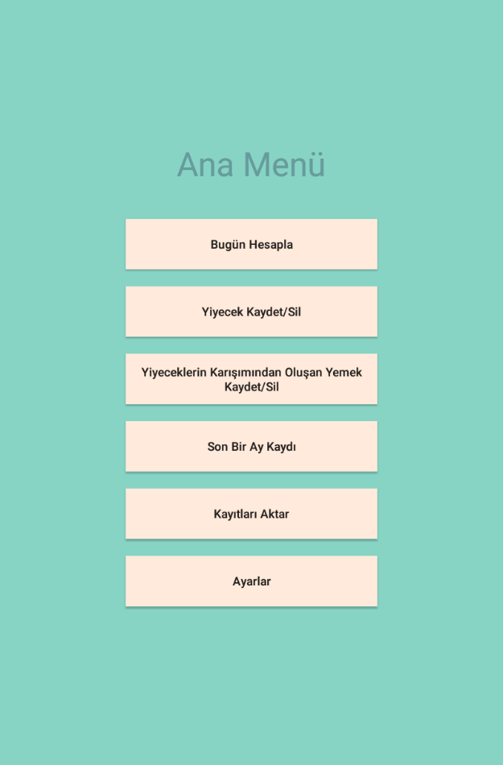
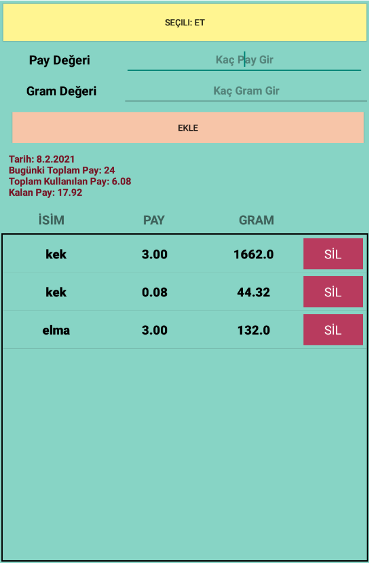
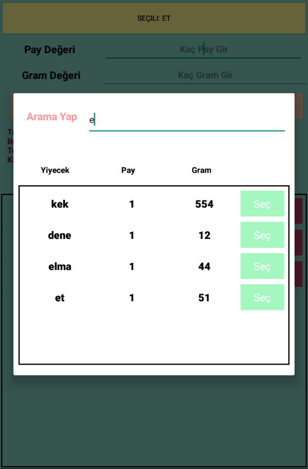
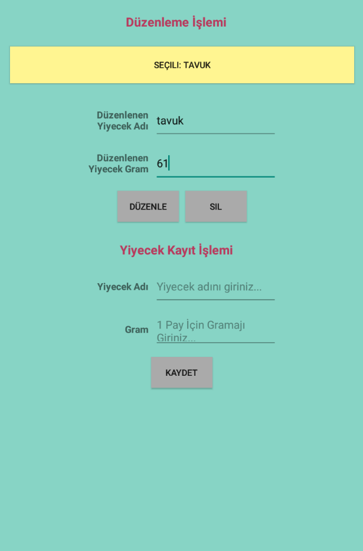
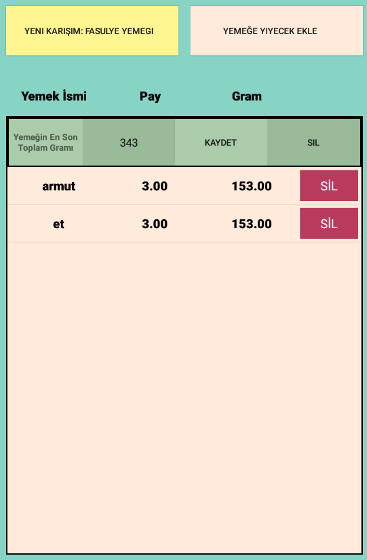
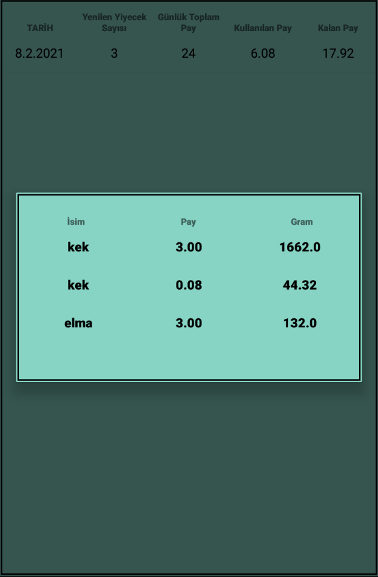
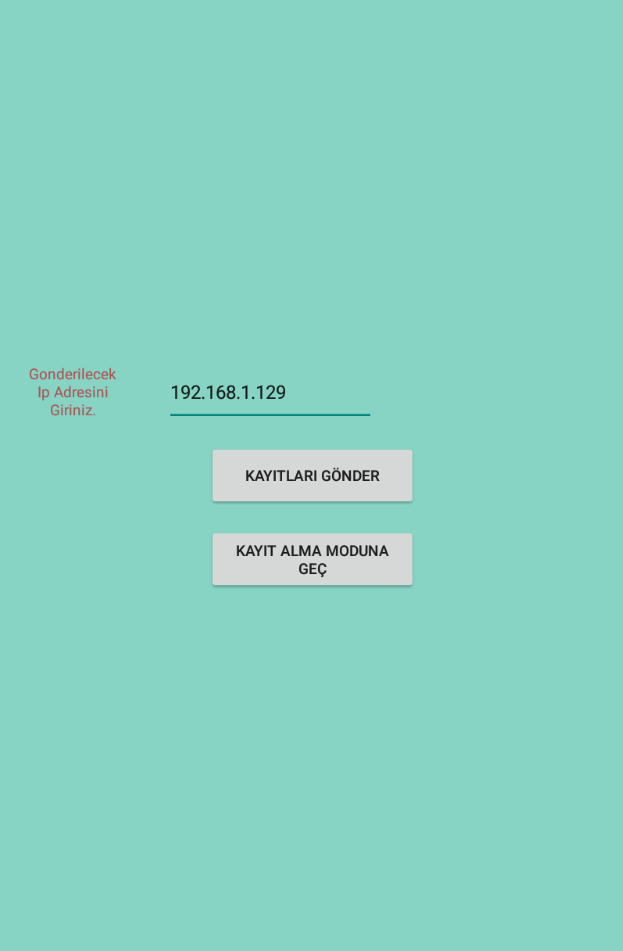
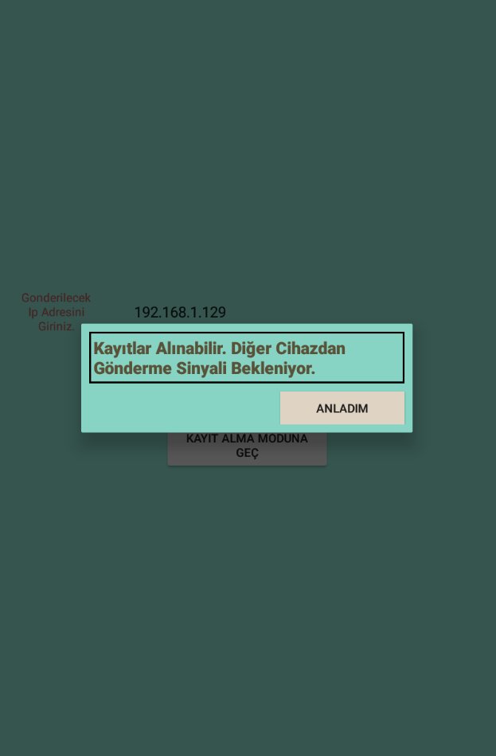

## Project Information
--- 
* Project Name:  
Diet
 

* Project Team:  
Fadıl Şahin
 

* Project Date:  
July 2020
 

* Project State And Duration:  
Done, 3 days
 

* Project Description:  
This app is developed to do a diet for myself and my family. With this app user can save gram of a food for one portion ( 1 portion is 50 kcal ) and calculate how much should I eat today to lose weight. There is no restriction to create only a food, mixed foods contains another foods inside can be created. Also these lists can be transfered other app users via internet. User just need its ip address. But for modems in home, there can be need to port forwarding for a specific device.
 
 

:exclamation: ***Usable apk is inside [images-and-apk](images-and-apk/Diet.apk) folder*** :exclamation:

## Screenshots
---

## Menu Page ##

## Today's Calculation Page ##

## Search Dialog ##

## Add,Delete And Update Food Page ##

## Add, Delete and Update Mixed Food Page ##

## Month Analysis Page ##

## Food Data Transfering Page ##

## Example For All Info Dialogs ##

